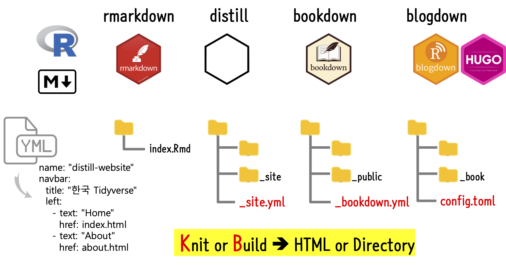

```{r setup, include=FALSE}
knitr::opts_chunk$set(echo = TRUE, message=FALSE, warning=FALSE,
                      comment="", digits = 3, tidy = FALSE, prompt = FALSE, 
                      fig.align = 'center')
library(tidyverse)
library(extrafont)
loadfonts()
```

# `.yml` 파일의 힘

- [`iris` 블로그](iris.html)

```{r how-to-read-yaml}
library(tidyverse)

readr::read_lines("_site.yml") %>% 
  str_remove_all('\"')
```


# R 콘텐츠 공유 



# GitHub 공유

[데이터 과학을 위한 저작도구: Computational Documents, "GitHub 호스팅"](https://statkclee.github.io/comp_document/cd-github-hosting.html)을 참조하여 
[Distill 웹사이트](https://statkclee.github.io/sharing-distill/)를 제작한다. 원본 파일과 관련 코드는 [Sharing Rmarkdown distill paper](https://github.com/statkclee/sharing-distill) GitHub 저장소를 참조한다.

```{r webshot-github-setting}
webshot2::webshot("https://statkclee.github.io/comp_document/cd-github-hosting.html", selector = "#deploy-dashboard-gh-pages-sources > div.figure > img", "fig/github-pages.png")
```


